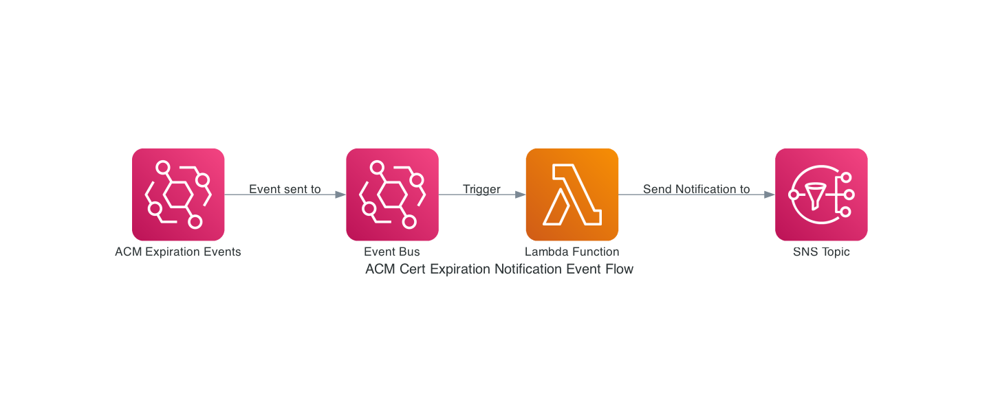
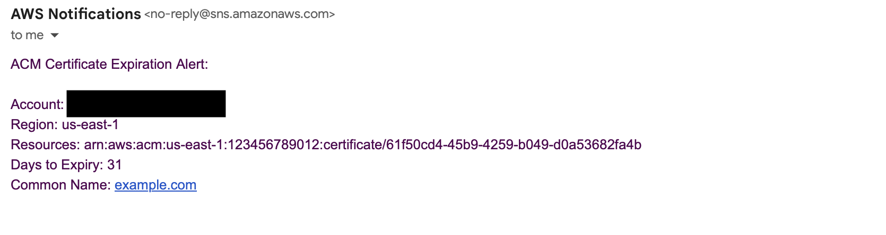

# acm-cert-expiry-notification
This repo code alerts subscribers of the SNS topics when a certificate issued by ACM is going to expire.

# TODO
    - Create SNS Topic :- Implemented
    - Create Email Subscription :- Implemented
    - Create Lambda Execution Role :- Implemented
    - Create Lambda :- Implemented
    - Create Event Bus Rule :- Implemented
    - Test with Sample EVent Bus Rule :- Tested

# Architecture Diagram

# Sample Event Email Example

<!-- BEGIN_TF_DOCS -->
## Requirements

| Name | Version |
|------|---------|
|  [terraform](#requirement\_terraform) | ~> 1.9.0 |
|  [aws](#requirement\_aws) | >= 5.72.1 |

## Providers

| Name | Version |
|------|---------|
|  [archive](#provider\_archive) | n/a |
|  [aws](#provider\_aws) | >= 5.72.1 |

## Modules

No modules.

## Resources

| Name | Type |
|------|------|
| [aws_cloudwatch_event_rule.acm_expiration_rule](https://registry.terraform.io/providers/hashicorp/aws/latest/docs/resources/cloudwatch_event_rule) | resource |
| [aws_cloudwatch_event_target.lambda_acm_expiration_sns](https://registry.terraform.io/providers/hashicorp/aws/latest/docs/resources/cloudwatch_event_target) | resource |
| [aws_iam_role.lambda_execution_role](https://registry.terraform.io/providers/hashicorp/aws/latest/docs/resources/iam_role) | resource |
| [aws_iam_role_policy.lambda_sns](https://registry.terraform.io/providers/hashicorp/aws/latest/docs/resources/iam_role_policy) | resource |
| [aws_iam_role_policy_attachment.lambda_cloudwatchlogs_policy_attachment](https://registry.terraform.io/providers/hashicorp/aws/latest/docs/resources/iam_role_policy_attachment) | resource |
| [aws_lambda_function.acm_expiration_sns](https://registry.terraform.io/providers/hashicorp/aws/latest/docs/resources/lambda_function) | resource |
| [aws_lambda_permission.allow_eventbridge](https://registry.terraform.io/providers/hashicorp/aws/latest/docs/resources/lambda_permission) | resource |
| [aws_sns_topic.acm_expiration](https://registry.terraform.io/providers/hashicorp/aws/latest/docs/resources/sns_topic) | resource |
| [aws_sns_topic_subscription.acm_expiration_alert](https://registry.terraform.io/providers/hashicorp/aws/latest/docs/resources/sns_topic_subscription) | resource |
| [archive_file.lambda_zip](https://registry.terraform.io/providers/hashicorp/archive/latest/docs/data-sources/file) | data source |

## Inputs

| Name | Description | Type | Default | Required |
|------|-------------|------|---------|:--------:|
|  [acm\_alert\_email\_list](#input\_acm\_alert\_email\_list) | Email addresses to which ACM certificates expiration alerts need to sent | `list(string)` | n/a | yes |
|  [application\_name](#input\_application\_name) | ACM Expiration Alert Application name | `string` | n/a | yes |
|  [lambda\_handler\_name](#input\_lambda\_handler\_name) | Lambda handler name | `string` | `"lambda_acm_expiration_sns.lambda_handler"` | no |
|  [lambda\_runtime](#input\_lambda\_runtime) | Lambda runtime | `string` | `"python3.8"` | no |

## Outputs

| Name | Description |
|------|-------------|
|  [event\_bus\_rule\_name](#output\_event\_bus\_rule\_name) | Event Bus Rule Name |
|  [lambda\_acm\_expiration\_function\_name](#output\_lambda\_acm\_expiration\_function\_name) | Lambda ACM Expiration Function Name |
|  [sns\_topic\_arn](#output\_sns\_topic\_arn) | SNS Topic ARN |
<!-- END_TF_DOCS -->

